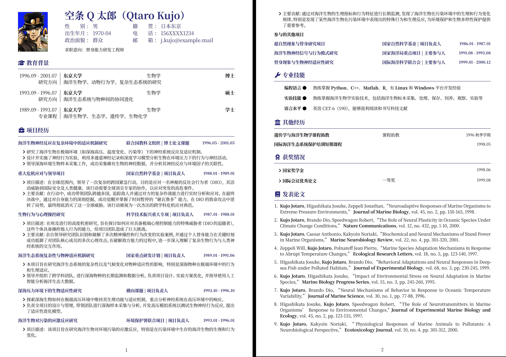

# Chinese Resume in Typst for PhD

在[方橙](https://github.com/OrangeX4/Chinese-Resume-in-Typst)的基础上修改，使之适用于硕/博士。

## 相比于方橙简历的修改
- 缩小纸张边距以容纳更多内容
- 个人信息转为网格列表形式来对齐
- 将项目经历存储为库的形式，用户可按照需求选择性地**显示重点项目，简单罗列非重点项目**，方便用户针对不同的面试需求进行简历调整（详细使用方法在下方）
- 添加了发表论文的部分，方便硕/博展示自己的学术成果

## 使用

### 在线编辑

可以使用 Typst 的 Web App,

模板链接: https://typst.app/project/rw1SLr0IIZZnCrkrsypRQF


### 本地编辑（推荐）

- 安装 VS Code，以及 [Tinymist Typst](https://marketplace.visualstudio.com/items?itemName=myriad-dreamin.tinymist) 插件。
- 打开 `resume.typ` 文件，按下 `Ctrl + K V` 快捷键后即可显示与编辑。
- 点击源代码顶部的 `Export PDF` 即可导出 PDF 文件。


## 示例

你可以使用 **简洁** 与 **组合式** 的语法出美观的效果.

```typst
// 设置简历选项与头部
#show: resume.with(
  // 字体基准大小
  size: 10pt,
  // 标题颜色
  themeColor: themeColor,
  // 控制纸张的边距
  top: 1.0cm,
  bottom: 1.0cm,
  left: 1.5cm,
  right: 1.5cm,

  // 如果需要姓名及联系信息居中，请删除下面关于头像的三行参数，并取消headerCenter的注释
  //headerCenter : true,
  
  // 如果不需要头像，则将下面三行的参数注释或删除
  photograph: "profile.png",
  photographWidth: 7em, // 头像宽度
  gutterWidth: 4em,     // 头像与文本之间的间距
)[

  // 姓名加大字号
  #set text(size: 15pt)
  = 空条Q太郎（Qtaro Kujo）

  #info(
    color: themeColor,
    // 个人信息以字典形式给出
    contact-options: (
      gender: "男",
      birthday: "1970-04",
      politics: "群众",
      birthplace: "日本东京",
      mobile: "156XXXX1234",
      email: link("mailto:j.kujo@example.mail")[j.kujo\@example.mail],
      // github 与 orcid 可以取消注释并修改链接
      //github: link("https://github.com/TimoLin")[github.com/TimoLin],
      //orcid: link("https://orcid.org/0000-0002-xxxx-xxxx")[0000-0002-xxxx-xxxx],
    )  
  )
][
  // 不需要的话可以删除
  //#set text(size: 11pt)
  求职意向：替身能力研发工程师
]
```

以及每一个块

```typst
== #faGraduationCap 教育背景

#sidebar(withLine: true, sideWidth: 18%)[
  #set text(size: 11pt)
  1996.09 - 2001.07

  研究方向
][
  #set text(size: 11pt)
  // 对齐
  *东京大学*#h(1fr)生物学#h(1fr)*博士*

  // 研究方向
  海洋生物学、动物行为学、复杂生态系统的研究
]
```

## `项目经历`模块说明
硕/博士的项目经历可能会有很多，为了方便用户根据不同的面试需求进行简历调整，例如：
1. 申请实验类的工作，可以选择性地突出实验研究相关的项目
2. 申请数值模拟/算法类工作，可以选择性地突出编程与数值模拟相关的项目

因此，模板中将项目经历存储为库的形式，放在`projects.typ`中，用户可以按照需求选择性地**显示重点项目**，**简单罗列非重点项目**。

### `projects.typ` 语法说明：
`projects.typ` 中的`projs`为存储项目经历的字典或库，`id1`为项目1的代号。

```typst
#let projs = (
  id1: //项目代号，用于在简历中进行引用
  (
    name: "项目名称",
    source: "项目来源（国自然/横向等等）",
    role: "在项目中的角色（项目负责人/主要参与人）",
    time: "项目起止时间"
    details: //项目描述，可以包括项目简介、作者承担的主要工作等 
    (
       "项目简介",
       "主要工作",
       ”研究成果“
    )
  ),
  id2:
  (
    ...
  )
）
```

### 如何在简历中引用不同的项目经历
在简历中引用项目经历时，需要创建字符串数组。
例如我们希望详细介绍`"deep_sea"`和`"fight_dio"`两个项目，简单列出`"study_stand"`和`"ocean_behavior"`两个项目的标题，如下所示：
```typst
== #faWork 项目经历

// 突出展示的项目经历
#let mainProjs = (
  "deep_sea",
  "fight_dio",
)

// 不重要的项目
#let otherProjs = (
  "study_stand",
  "ocean_behavior",
)

```
程序中会根据`mainProjs`和`otherProjs`的内容，自动遍历相应的数组，来展示指定的项目。代码如下：
```typst
// 列出想要突出展示的项目经历
// showDetails默认为ture，即展示项目详情
#for p in mainProjs {
  let data = projs.at(p)
  itemProj(
    color: themeColor,
    data.name,
    data.source,
    data.role,
    data.time,
    data.details
  )
}

#item(
  [*参与的其他项目*],
  [],
  date[]
)

// 仅列出其他不重要的项目名称/来源/时间
// showDetails设置为false，即不展示项目详情
#for p in otherProjs {
  let data = projs.at(p)
  itemProj(
    color: themeColor,
    data.name,
    data.source,
    data.role,
    data.time,
    data.details,
    showDetails: false
  )
}
```

## 效果

包含照片:




